# 《基于AI的易燃易爆物质燃爆初期火焰图像快速识别研究》方案

## 1. 系统概述

### 1.1 项目背景
传统火灾报警系统往往依赖于烟雾探测器或温度传感器，但这些方法在识别初期火灾或隐蔽火源时存在局限性。随着视频监控技术的普及和深度学习算法的快速发展，基于视频流的火灾识别技术逐渐成为研究热点。本系统是一个基于深度学习的实时火灾视频识别系统，通过实时分析监控视频，实现对火焰和烟雾的精准识别，从而提高火灾预警的准确性和及时性，为火灾预警提供技术支持。系统采用前后端分离架构，前端使用React、TypeScript和Vite构建，后端则采用Python Flask框架，并集成了先进的计算机视觉算法。

### 1.2 设计目标
* 通过系统的高精度算法，实现对火焰和烟雾的即时识别与报警，减少误报和漏报情况，提升火灾预警效率。ROI检测功能允许用户自定义监控区域，
* 集中资源对关键区域进行高效监控，提高监测的针对性和有效性。
* Web界面设计友好，用户可通过简单操作即可完成视频流的接入、检测模式的选择和检测结果的查看。
* 多种检测模式适应不同场景需求，无论是简单分类还是复杂的目标检测，系统均能提供准确的结果。
* WebSocket实时通信技术确保前端与后端之间的数据传输快速且稳定，用户可实时获取最新的检测结果。
* 系统不仅支持实时摄像头输入，还可处理已录制的视频文件，方便用户进行历史数据分析和回溯。检测结果的可视化展示直观明了，帮助用户快速理解火焰或烟雾的存在及其位置，便于及时采取应对措施。

### 1.3 技术架构
系统采用React+TypeScript前端配合Flask+AI后端的架构，通过WebSocket实现实时双向通信。

## 2. 系统架构设计

### 2.1 总体架构图

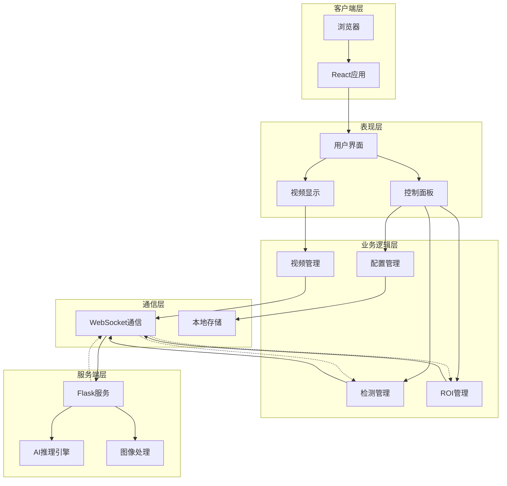
架构设计理念说明：

这个分层架构图体现了现代Web应用的最佳实践。客户端层采用浏览器作为统一的运行环境，确保了跨平台兼容性。React应用层提供了组件化的开发模式，通过虚拟DOM技术实现了高效的界面更新机制。

表现层设计思想：

表现层的三个核心组件各司其职：用户界面负责整体布局和交互逻辑，视频显示组件专注于媒体流的渲染和控制，控制面板则提供了丰富的操作选项。这种职责分离的设计使得每个组件都具有高内聚、低耦合的特点，便于独立开发和测试。

业务逻辑层架构优势：

业务逻辑层的四个管理模块形成了完整的功能闭环。视频管理模块处理多媒体流的生命周期，检测管理模块控制AI算法的执行策略，ROI管理模块实现了精确的区域检测功能，配置管理模块则确保了系统参数的持久化和一致性。这种模块化设计支持功能的独立扩展和维护。

通信层技术选型：

WebSocket单一协议设计专注于实时通信需求。WebSocket用于所有数据传输，包括视频帧、检测结果、配置更新等，保证了毫秒级的响应速度和统一的通信机制，简化了系统架构并提高了实时性能。

服务端层设计特色：

服务端采用Flask轻量级框架，配合AI推理引擎和图像处理模块，形成了高效的后端服务架构。这种设计既保证了Web服务的稳定性，又充分利用了Python在AI领域的生态优势。

### 2.2 模块层次结构
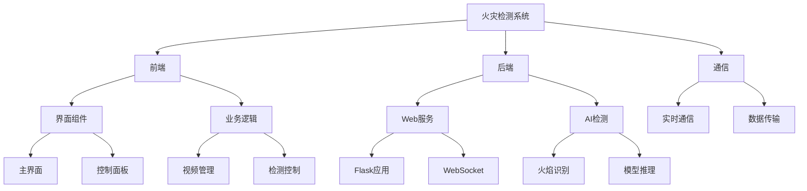
分层设计原理：

这个三层架构遵循了软件工程中的分层设计原则。前端模块专注于用户体验和界面交互，后端模块负责核心业务逻辑和AI算法，通信模块则作为桥梁确保数据的可靠传输。每一层都有明确的职责边界，避免了功能耦合。

前端模块细分说明：

前端的三层结构体现了MVC模式的变种。界面展示层相当于View层，负责UI渲染和用户交互；业务逻辑层相当于Controller层，处理用户操作和状态管理；数据处理层则负责数据的获取、转换和缓存，确保了数据流的单向性和可预测性。

后端模块架构特点：

后端的分层设计体现了领域驱动设计的思想。Web服务层提供标准化的接口服务，AI算法层封装了核心的业务能力，数据处理层则处理各种格式转换和预处理任务。这种设计使得AI算法可以独立演进，不受Web框架的限制。

通信模块设计考量：

通信模块的三个子模块覆盖了分布式系统的核心需求。实时通信确保了用户体验的流畅性，数据传输保证了信息的完整性，错误处理则提供了系统的健壮性。这种设计使得系统能够优雅地处理网络异常和服务故障。

## 3. 前端模块设计
### 3.1 组件关系图
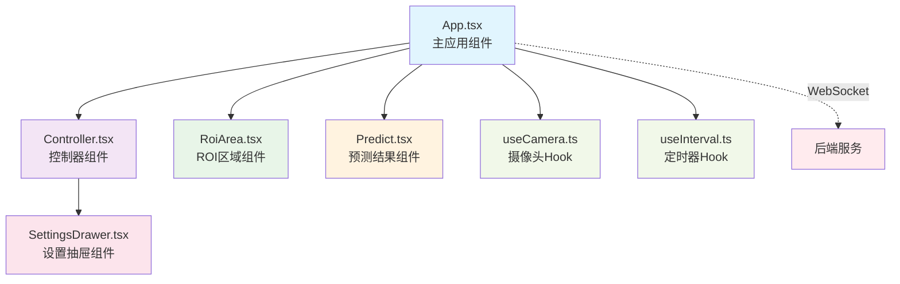
组件设计哲学：

这个组件关系图体现了React函数式编程的最佳实践。App组件作为状态管理的中心，采用了状态提升的设计模式，确保了数据流的单向性。子组件通过props接收状态和回调函数，实现了组件间的松耦合。

Hook设计模式优势：

useCamera和useInterval两个自定义Hook展现了React Hooks的强大能力。它们将复杂的业务逻辑封装成可复用的函数，既提高了代码的可维护性，又增强了组件的可测试性。这种设计使得组件职责更加单一，符合单一职责原则。

组件通信机制：

组件间的通信采用了props传递和回调函数的模式，配合TypeScript的类型检查，确保了接口的类型安全。WebSocket连接作为外部依赖，通过useEffect Hook进行管理，保证了副作用的正确处理和清理。

状态管理策略：

系统采用了分层状态管理策略。全局状态（如WebSocket连接、检测结果）由App组件管理，局部状态（如抽屉开关、表单输入）由各自组件管理。这种设计既避免了状态管理的复杂性，又保证了组件间的独立性。

### 3.2 组件交互序列图
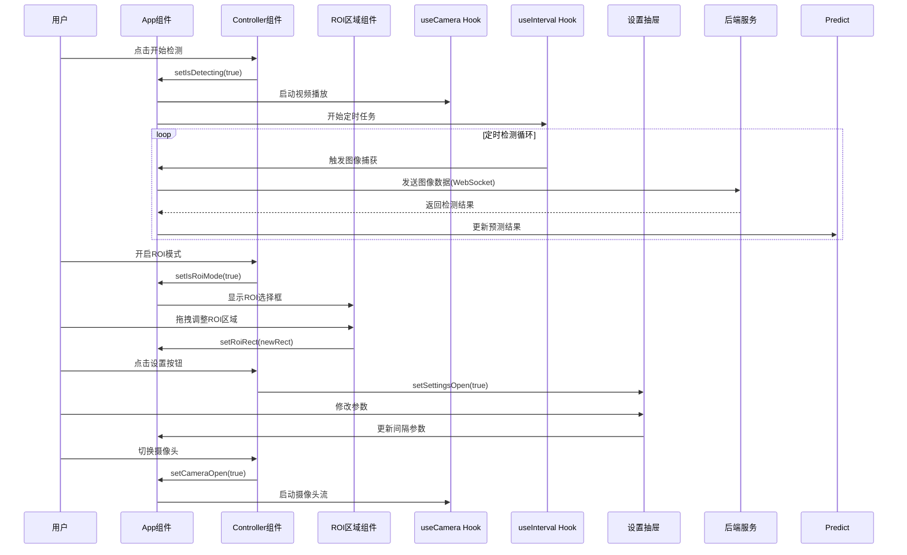
交互流程设计：

这个序列图展现了用户操作到系统响应的完整流程。从用户点击开始检测到最终结果显示，每个步骤都有明确的责任主体和数据流向。这种设计确保了用户操作的即时反馈和系统状态的一致性。

异步处理机制：

定时检测循环体现了系统的实时处理能力。通过useInterval Hook实现的定时任务，配合WebSocket的异步通信，确保了检测过程的连续性和稳定性。这种设计避免了阻塞用户界面，提供了流畅的用户体验。

ROI功能交互：

ROI模式的交互流程展现了系统的灵活性。用户可以随时开启ROI模式，通过拖拽操作精确选择检测区域。这种交互设计既满足了专业用户的精确需求，又保持了操作的简单直观。

配置管理交互：

设置抽屉的交互流程体现了系统的可配置性。用户可以根据实际需求调整检测参数，系统会实时应用这些配置。这种设计提高了系统的适应性和用户的控制感。

### 3.3 状态管理图
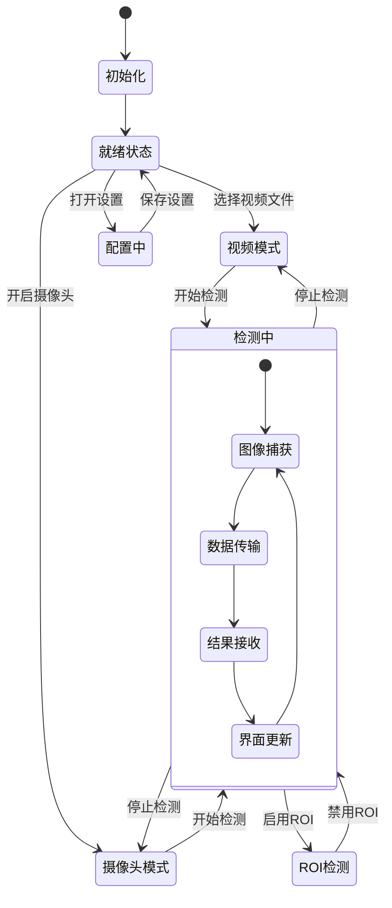
状态转换逻辑：

这个状态图清晰地展现了系统的运行状态和转换条件。从初始化到就绪状态，再到各种工作模式，每个状态转换都有明确的触发条件。这种设计确保了系统状态的可预测性和一致性。

模式切换机制：

视频模式和摄像头模式的切换体现了系统的灵活性。用户可以根据实际场景选择不同的输入源，系统会自动适配相应的处理逻辑。这种设计提高了系统的适用范围和用户体验。

检测状态管理：

检测中状态的内部循环展现了实时处理的核心逻辑。从图像捕获到界面更新的循环过程，确保了检测结果的实时性和准确性。ROI检测作为检测中的子状态，提供了更精确的检测能力。

配置状态处理：

配置中状态的设计体现了系统的可维护性。用户可以在任何时候进入配置模式，调整系统参数后立即生效。这种设计提高了系统的灵活性和用户的控制能力。
### 3.4 系统界面展示
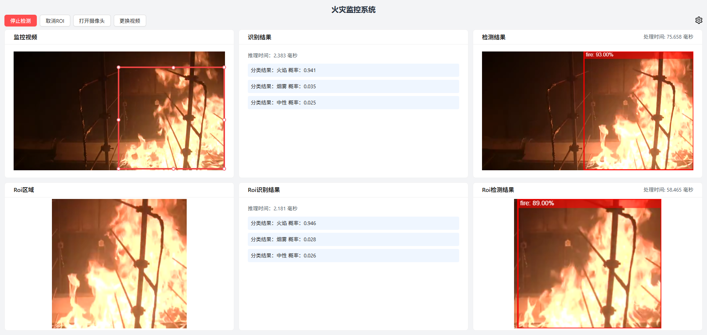
*图3.1 火灾检测系统主界面 - 展示了完整的用户界面布局，包括视频显示区域、控制面板和检测结果展示区*
系统主界面采用现代化的响应式设计，左侧为视频显示区域，右侧为控制面板和检测结果展示。界面简洁直观，用户可以快速上手操作。

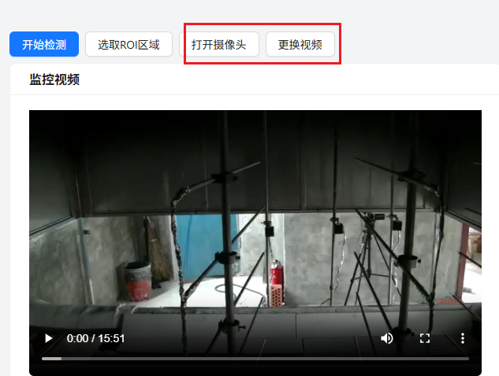
*图3.2 视频与摄像头选择控制 - 用户可以实时对摄像头进行监控，也可以上传已有视频进行分析*

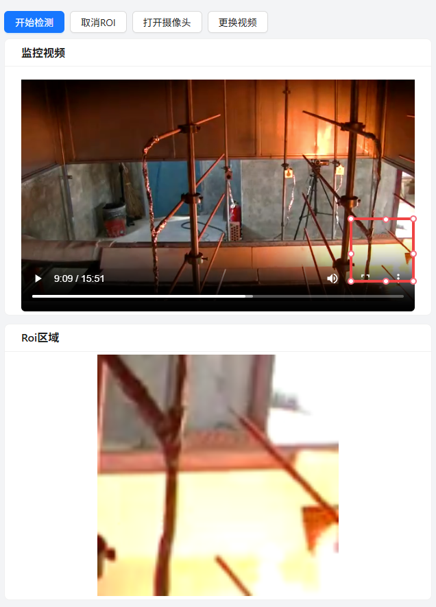
*图3.3 ROI区域选择界面 - 用户可以通过拖拽方式选择感兴趣区域，提高检测精度和效率*

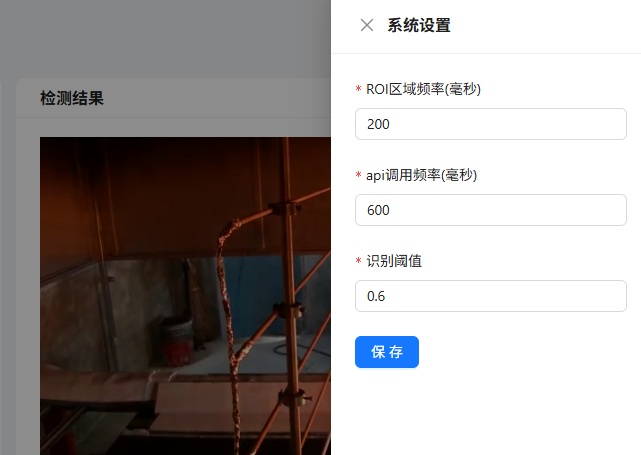
*图3.4 设置抽屉界面 - 显示了详细的参数配置选项，包括检测间隔、置信度阈值等*

## 4. 后端模块设计
### 4.1 服务架构图
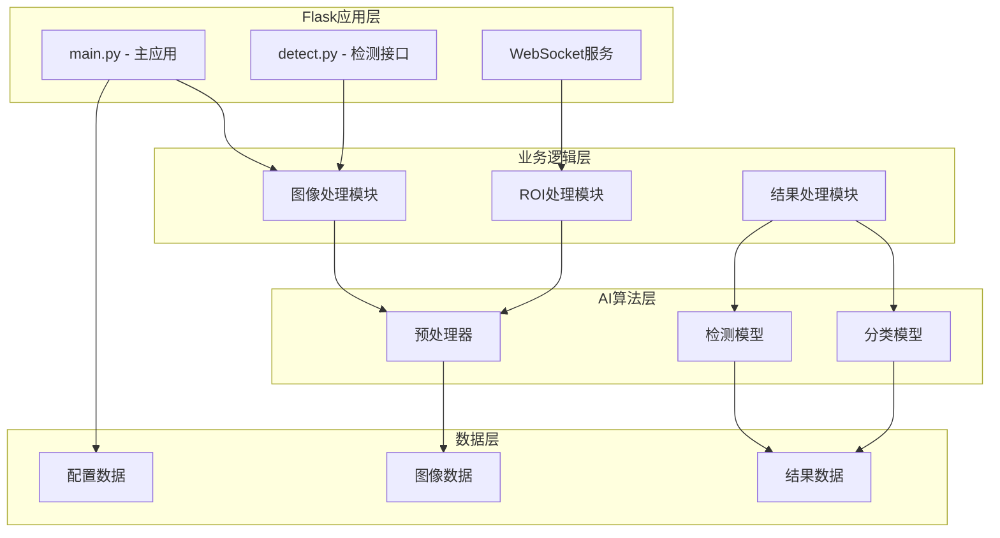
服务分层设计：

后端服务的四层架构体现了企业级应用的设计标准。Flask应用层提供标准化的Web服务接口，业务逻辑层处理核心的业务规则，AI算法层封装了专业的算法能力，数据层则负责各种数据的存储和管理。

模块职责划分：

每个模块都有明确的职责边界。主应用负责整体的服务协调，检测接口提供标准化的API服务，WebSocket服务处理实时通信需求。这种设计确保了服务的高内聚、低耦合特性。

AI算法集成：

AI算法层的三个组件形成了完整的推理流水线。预处理器负责数据的标准化，分类模型和检测模型提供不同的AI能力，这种设计支持多种算法的并行运行和结果融合。

数据管理策略：

数据层的设计考虑了不同类型数据的特点。图像数据采用流式处理，配置数据支持持久化存储，结果数据则采用缓存机制。这种设计优化了系统的性能和资源利用率。

### 4.2 数据流图
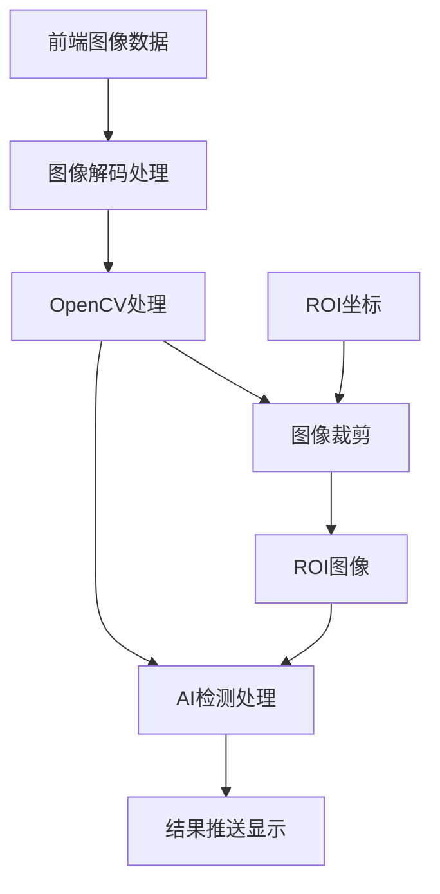
数据处理流水线：

这个数据流图展现了从前端图像到最终结果的完整处理流程。每个处理步骤都有明确的输入输出格式，确保了数据转换的准确性和一致性。Base64编码和解码环节保证了图像数据在网络传输中的完整性。

并行处理机制：

原图和ROI图像的并行处理体现了系统的高效性。两条处理路径可以同时进行AI推理，既提供了全局检测结果，又提供了局部精确检测。这种设计满足了不同场景的检测需求。

结果融合策略：

检测结果和ROI检测结果的融合处理体现了系统的智能性。通过结果封装和WebSocket推送，用户可以同时看到全局和局部的检测效果，提高了检测的准确性和可信度。

性能优化考虑：

整个数据流的设计充分考虑了性能优化。图像格式转换采用了高效的算法，AI处理支持批量推理，结果传输采用了压缩技术。这些优化确保了系统的实时性和稳定性。

## 5. 通信模块设计
### 5.1 通信协议图
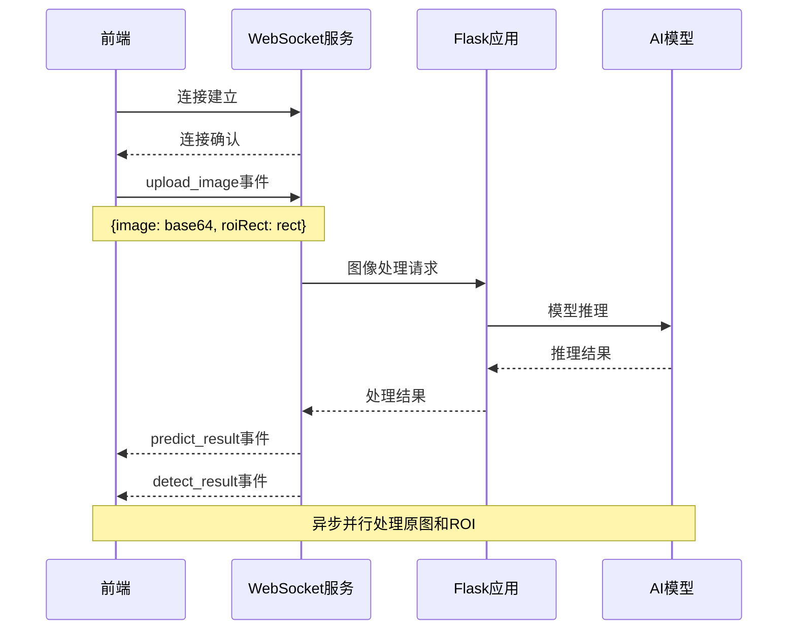
协议设计原理：

这个通信协议图展现了前后端实时通信的完整流程。WebSocket连接的建立和维护确保了双向通信的稳定性，事件驱动的通信模式提高了系统的响应速度和资源利用率。

异步处理优势：

异步并行处理原图和ROI的设计体现了系统的高效性。Flask应用可以同时处理多个AI推理任务，通过多线程技术实现真正的并行计算。这种设计大大提高了系统的吞吐量和响应速度。

事件驱动机制：

基于事件的通信模式避免了传统请求-响应模式的局限性。前端可以随时发送图像数据，后端可以随时推送检测结果，这种设计提供了更好的用户体验和系统性能。

错误处理策略：

通信协议中包含了完善的错误处理机制。连接异常、数据传输错误、AI推理失败等各种异常情况都有相应的处理策略，确保了系统的健壮性和可靠性。

### 5.2 接口设计图
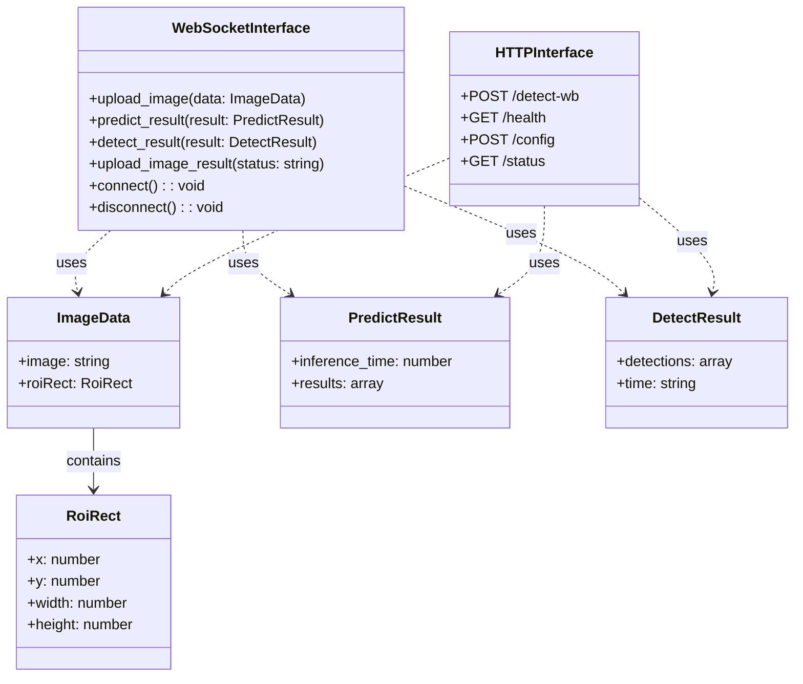
接口设计规范：

这个接口设计图体现了RESTful API和WebSocket API的最佳实践。每个接口都有明确的功能定义和数据格式规范，确保了前后端开发的一致性和可维护性。

数据结构标准化：

统一的数据结构设计确保了系统各个组件之间的兼容性。ImageData、PredictResult、DetectResult等数据类型都有明确的字段定义和类型约束，避免了数据格式不一致的问题。

类型安全保障：

通过TypeScript的类型定义和Python的类型注解，整个系统实现了端到端的类型安全。这种设计大大减少了运行时错误，提高了代码的可靠性和可维护性。

扩展性考虑：

接口设计充分考虑了未来的扩展需求。数据结构支持可选字段，接口支持版本控制，这些设计为系统的演进提供了良好的基础。

## 6. 核心功能模块
### 6.1 视频处理模块
功能描述 : 负责视频流的获取、处理和显示

主要组件 :

- useCamera.ts : 摄像头管理Hook
- App.tsx : 视频显示和控制
- Canvas处理: 图像捕获和绘制
处理流程 :
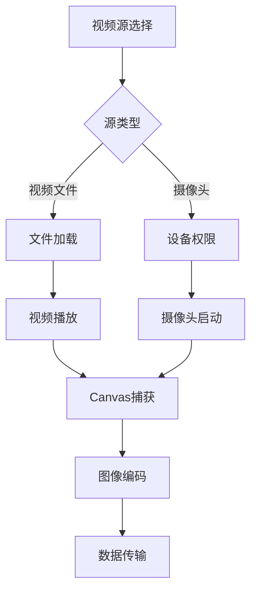
模块化设计理念：

视频处理模块支持多种输入源的统一处理。无论是本地视频文件还是实时摄像头流，都通过统一的Canvas接口进行处理，这种设计提高了系统的兼容性和灵活性。

### 6.2 ROI检测模块
功能描述 : 实现感兴趣区域的选择和独立检测

主要组件 :

- RoiArea.tsx : ROI区域选择组件
- React-RND: 拖拽和缩放库
交互流程 :
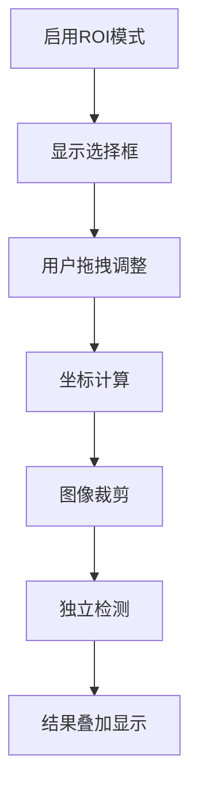
ROI检测创新：

ROI检测模块的设计体现了系统的专业性。用户可以精确选择感兴趣的区域进行独立检测，这种功能在实际应用中具有重要价值，可以显著提高检测的准确性和效率。

### 6.3 AI检测模块
功能描述 : 核心的火焰检测算法实现

算法流程 :
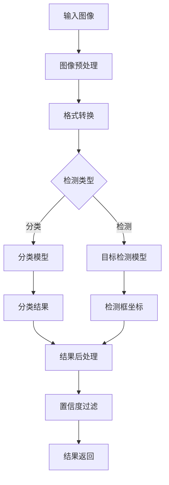
AI算法集成：

AI检测模块支持多种算法的并行运行。分类和检测算法可以同时对同一图像进行处理，提供不同维度的检测结果。这种设计提高了检测的全面性和可靠性。

## 7. 部署架构设计
### 7.1 部署拓扑图
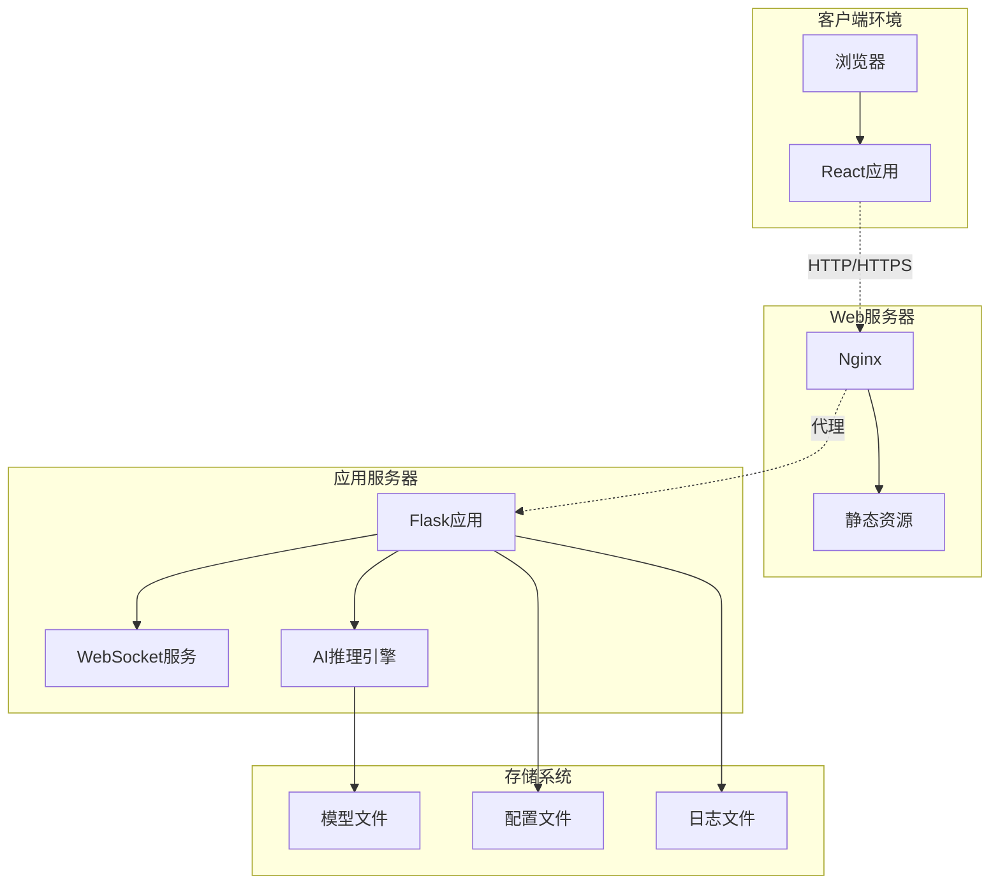
部署策略设计：

部署拓扑图展现了从开发到生产的完整部署策略。每个环境都有相应的技术栈和配置，确保了系统在不同阶段的稳定运行。这种分层部署策略降低了部署风险，提高了系统的可靠性。

### 7.2 技术栈部署
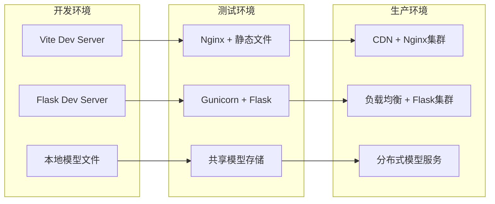
技术栈演进：

技术栈部署图体现了系统的可扩展性。从单机开发环境到分布式生产环境，系统可以根据负载需求进行水平扩展。这种设计为系统的商业化应用提供了技术保障。

服务治理考虑：

生产环境的设计包含了完善的服务治理机制。负载均衡、集群部署、分布式存储等技术确保了系统的高可用性和高性能。这些设计体现了企业级应用的技术要求。

运维友好设计：

整个部署架构充分考虑了运维的便利性。标准化的部署流程、自动化的监控告警、完善的日志管理等功能为系统的长期稳定运行提供了保障。

## 8. 安全设计
### 8.1 数据安全
- WebSocket连接加密(WSS)
- 图像数据传输加密
- 敏感信息脱敏处理
### 8.2 系统安全
- CORS跨域安全配置
- 输入数据验证和过滤
- 错误信息安全处理
- 访问频率限制
## 9. 总结
火灾视频识别系统的设计充分体现了现代软件工程的最佳实践。通过分层架构、模块化设计、组件化开发等方式，构建了一个高性能、高可用、易维护的实时检测系统。

系统的核心优势包括：

1. 技术先进性 : 采用React+Flask的现代技术栈，结合深度学习算法
2. 架构合理性 : 前后端分离，职责清晰，扩展性强
3. 功能完整性 : 支持多种检测模式，ROI精确检测，实时通信
4. 性能优异性 : 异步处理，并行计算，优化传输
5. 安全可靠性 : 完善的错误处理，安全防护，监控告警
这些设计决策和技术选型为系统的成功实施和长期演进奠定了坚实的基础。